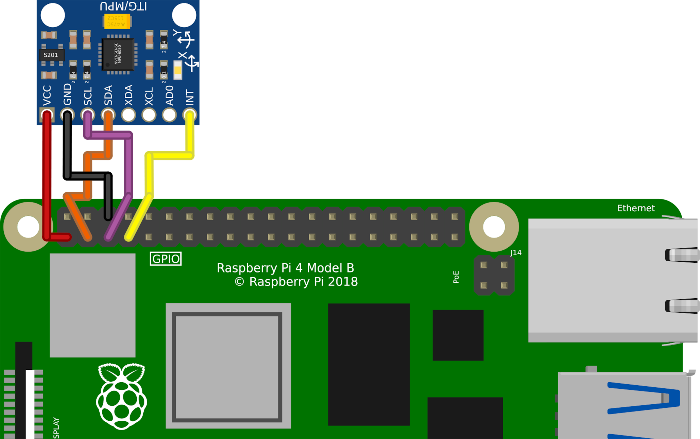
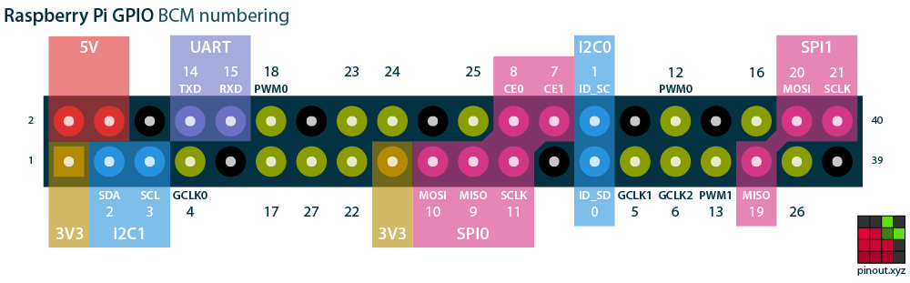

# IMU integration
To ensure that the head mounted lasers are safetly used in the CVG system, we are implementing a safety shutoff feature utilizing an IMU.

## Physical Connection
{width=400}

{width=650}

> [!Note] 
> This device can be connected on on a different i2c bus or with a different interupt pin. If you wish to do so, ensure you adjust the variables passed to dtoverlay when defining the pin connections.

## Pin Definition
A device tree overlay for this sensor already already exists in the standard Raspbian linux images.
Enabling this device requires a single line addition to `/boot/config.txt`

Examples for device tree configuration can be found in the linux kernel's documentation.
For example [https://github.com/torvalds/linux/blob/master/Documentation/devicetree/bindings/iio/imu/invensense%2Cmpu6050.yaml](https://github.com/torvalds/linux/blob/master/Documentation/devicetree/bindings/iio/imu/invensense%2Cmpu6050.yaml)
> [!TODO] 
> Add mounting matrix to our device tree

> [!Note] 
> See: `/boot/overlays/README` 

### buster (oldoldstable; kernel 5.10.y)
Modify the overlay for mpu6050 to configure the driver correctly. 

This device tree fragment can be compiled then moved to `/boot/overlays/`.
```sh
# I copied and renamed the file from a local git of the RPi linux kernel (you may copy&paste from github)
scp ianzur@jasmine:~/Documents/projects/rpi-linux-5.10/arch/arm/boot/dts/overlays/mpu6050-overlay.dts mpu9250-overlay.dts 

# make the changes as show in file "mpu9250-overlay.dts", then compile
dtc -@ -Hepapr -I dts -O dtb -o mpu9250.dtbo mpu9250-overlay.dts

sudo mv mpu9250.dtbo /boot/overlays/
# this gave me an error about how this move required permission changes, that is okay.

# double checking that the file is there
ls -la /boot/overlays/mpu*
# should return:
# -rwxr-xr-x 1 root root 841 Apr  8  2024 /boot/overlays/mpu6050.dtbo
# -rwxr-xr-x 1 root root 841 Nov 25 16:50 /boot/overlays/mpu9250.dtbo 
```
> [!Note] 
> Information regarding compiling device tree files can be found here.
> [https://www.raspberrypi.com/documentation/computers/configuration.html#device-trees-overlays-and-parameters](https://www.raspberrypi.com/documentation/computers/configuration.html#device-trees-overlays-and-parameters)

Now add the folling lines to `/boot/config.txt`
```sh
# load overlay for mpu9250 (Invensense) 
dtoverlay=mpu9250,addr=0x68,int_pin=4
```
> [!Note]
> The MPU9250 is an upgrade of the MPU6050 that includes a magnometer.
> 
> devicetree definition src: [https://github.com/raspberrypi/linux/blob/rpi-5.10.y/arch/arm/boot/dts/overlays/mpu6050-overlay.dts](https://github.com/raspberrypi/linux/blob/rpi-5.10.y/arch/arm/boot/dts/overlays/mpu6050-overlay.dts)

### bullseye (oldstable; kernel 6.1.y)
Add the following lines to `/boot/config.txt`:
```sh
# load overlay for mpu9250 (Invensense)
dtoverlay=i2c-sensor,mpu9250,addr=0x68,int_pin=4 
```

> [!Note]
> The definition of this device tree overlay has moved to a "common" file. The actual definition has not changed.
>
> devicetree def src: [https://github.com/raspberrypi/linux/blob/rpi-6.1.y/arch/arm/boot/dts/overlays/i2c-sensor-common.dtsi](https://github.com/raspberrypi/linux/blob/rpi-6.1.y/arch/arm/boot/dts/overlays/i2c-sensor-common.dtsi)

### bookworm (stable; kernel 6.6.y)
Add the following lines to `/boot/firmware/config.txt`:
```sh
# load overlay for mpu9250 (Invensense)
dtoverlay=i2c-sensor,mpu9250,addr=0x68,int_pin=4 
```

> devicetree definition src: [https://github.com/raspberrypi/linux/blob/rpi-6.6.y/arch/arm/boot/dts/overlays/i2c-sensor-common.dtsi](https://github.com/raspberrypi/linux/blob/rpi-6.1.y/arch/arm/boot/dts/overlays/i2c-sensor-common.dtsi)

## Driver
No additional configuration is required for the sensor to be detected and the driver loaded. 
But many of the virtual files created that one uses to access the device can only be modified by the root user. So some file permissions need to be changed to access the iio sysfs files without elevated permissions (sudo). This can be done with a udev rule.

To maintain some security only users in the iio group may write to these files. Any user that needs to access these files should be added to the iio group `usermod -aG iio $USER`. 

> Note: if this group does not exist you may create it with `groupadd iio`

/etc/udev/rules.d/90-iio.rules
```
# copy owner permissions to group (chmod g=u ...) change group to iio (chgrp iio)
SUBSYSTEM=="iio", RUN+="/bin/sh -c 'chgrp -R iio /sys/bus/iio/devices/$kernel/ && chmod -R g=u /sys/bus/iio/devices/$kernel'"
SUBSYSTEM=="iio", KERNEL=="iio:device*", RUN+="/bin/sh -c 'chgrp iio /dev/$kernel && chmod g=u /dev/$kernel'"
```

> [!Note] 
> udev documentation can be found all over but my favorite is here: 
> [https://documentation.suse.com/sles/12-SP5/html/SLES-all/cha-udev.html](https://documentation.suse.com/sles/12-SP5/html/SLES-all/cha-udev.html)

> [!Note]
> This can be confirmed with `lsmod | grep inv_mpu6050`

> [!Note]
> I have seen some kernel messages regarding a failed interrupt acknowledgment. 
> Further investigation may be required. Again, is this IC genuine?
> 
> ```sh
>  [  225.939990] inv-mpu6050-i2c 1-0068: failed to ack interrupt
>  pi@rpi:~/imu-integration $ uname -a
>  Linux rpi 6.12.0-v8-xcompile+ #1 SMP PREEMPT Sun Nov 24 20:19:32 CST 2024 aarch64 GNU/Linux
> ```

Invensense contributed the driver for this device to the industrialio subsystem of the linux kernel. The driver is compiled as a module into rpi's linux kernel by *default*.

> For the curious: [https://github.com/torvalds/linux/tree/master/drivers/iio/imu/inv_mpu6050](https://github.com/torvalds/linux/tree/master/drivers/iio/imu/inv_mpu6050)

#### What the hell is IIO?
Industrial IO is a subsystem that was originally developed to communicate with sensors (specifically IMU's) by Jonathan Cameron for a wearables research project monitoring biomechanics of athletes.
This subsystem utilizes sysfs (a virtual file system inside) to create a standard way to communicate with may sensors.
IIO's goal is to support almost any device that is an ADC or DAC with a consistent user-space interface.

> [src - A presentation by James Cameron](https://www.youtube.com/watch?v=644oH1FXdtE)

- You may directly read & write from the files in `/sys/bus/iio/devices/iio:deviceN/buffer0/`
- Several userspace libraries exist to interface a bit more cleanly with iio:
  - [libiio (Analog Devices)](https://github.com/analogdevicesinc/libiio)
    - written in c, with python bindings
    - maintains a userspace library to connect to the iio subsystem
    - Additional userspace tools for debugging industrial stuff install libiio-utils (`apt install libiio-utils`)
    - TODO: Try github main (v1.0) also
  - sensor-proxy-iio
    - I haven't investigated this library
  - probably others
    - and we can roll our own. Especially since our application does not require high speed.

### Reading from the Sensor
I created two example scripts to verify reading from the sensor, both do the exact same thing. Both these scripts can be translated to c/c++. 

- direct_mpu9250_read.py
  - this script reads and modifies the sysfs files directly using only standard (builtin) python libraries.
- libiio_mpu9250_read.py
  - this script uses libiio to access the sysfs files associated with the mpu9250.
